# 课件

> 李善友

基于本书内容制作的讲课课件，共 16 页。点击任意一页可放大查看。

<figure>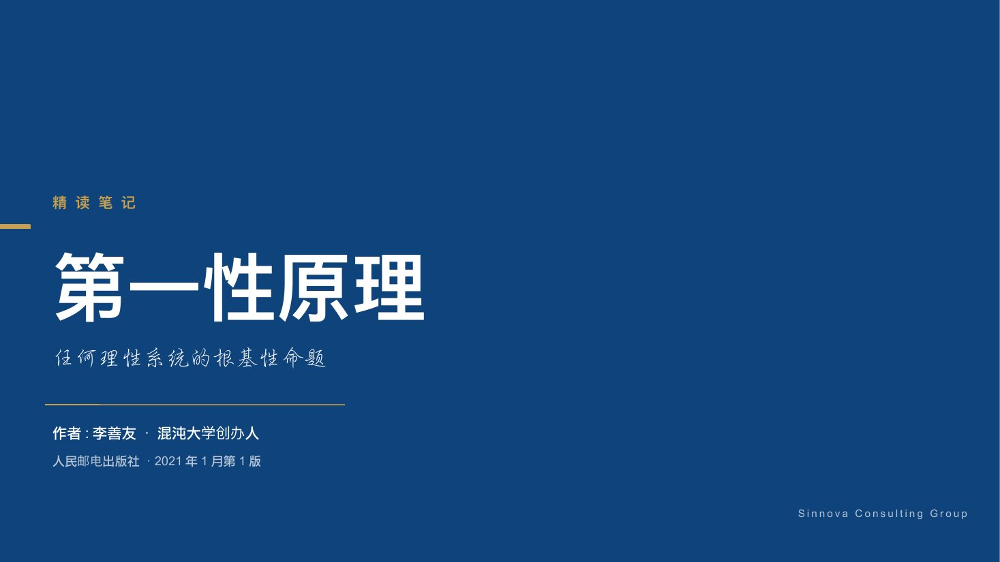<figcaption>1</figcaption></figure>
<figure>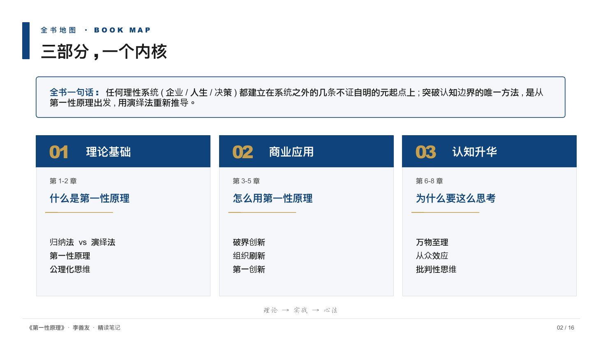<figcaption>2</figcaption></figure>
<figure>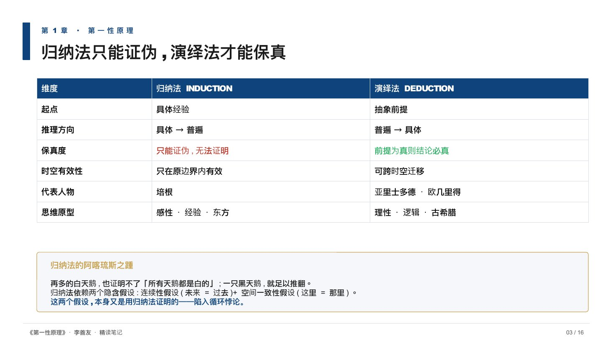<figcaption>3</figcaption></figure>
<figure>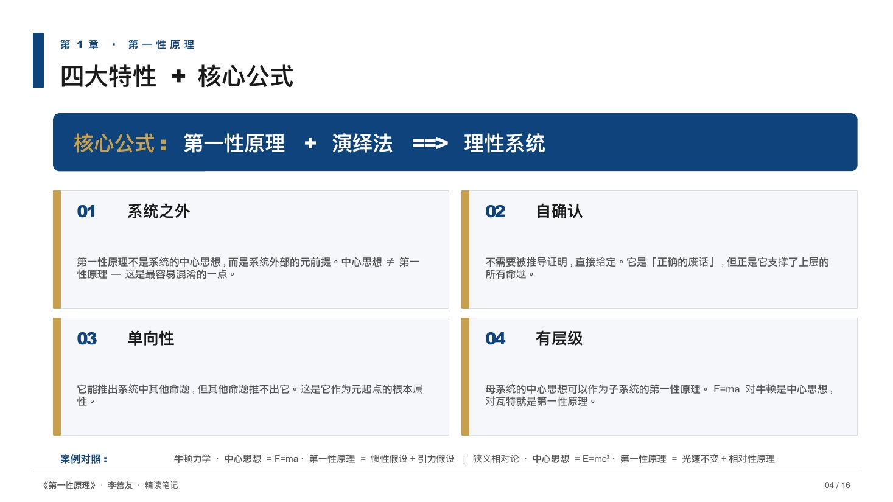<figcaption>4</figcaption></figure>
<figure>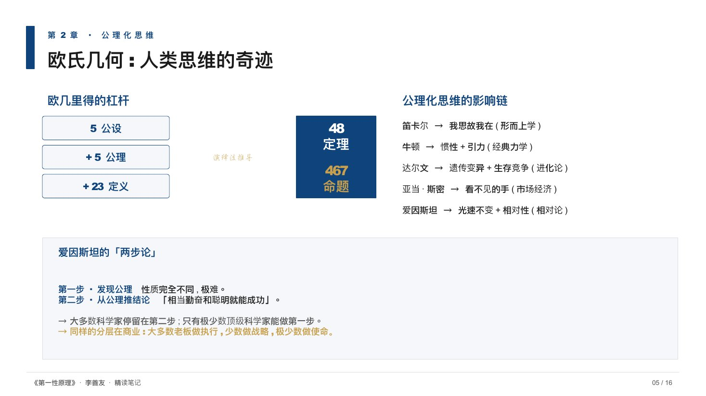<figcaption>5</figcaption></figure>
<figure><figcaption>6</figcaption></figure>
<figure><figcaption>7</figcaption></figure>
<figure><figcaption>8</figcaption></figure>
<figure>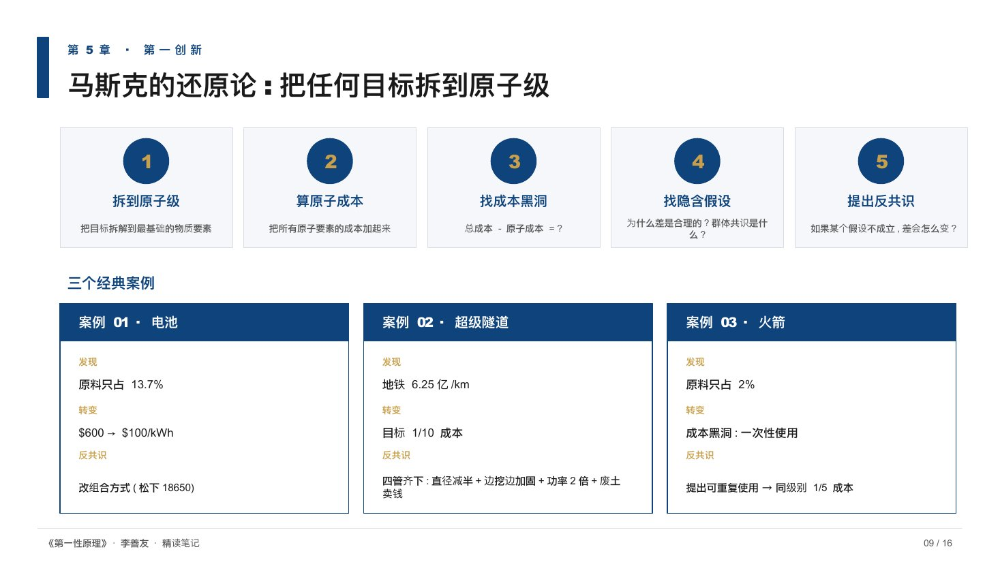<figcaption>9</figcaption></figure>
<figure>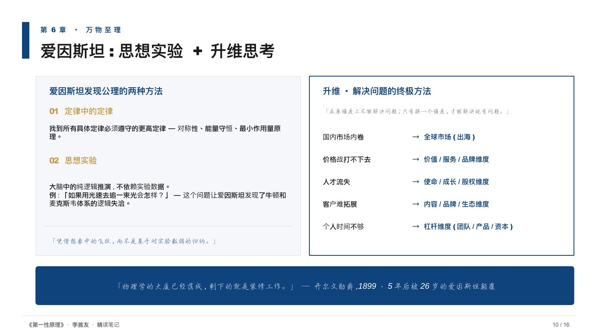<figcaption>10</figcaption></figure>
<figure>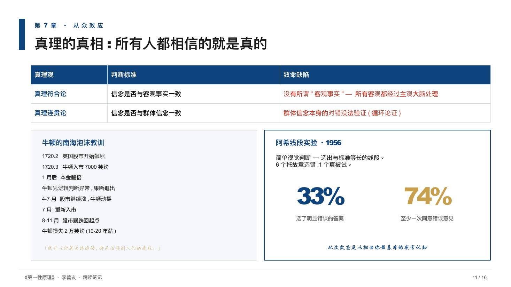<figcaption>11</figcaption></figure>
<figure>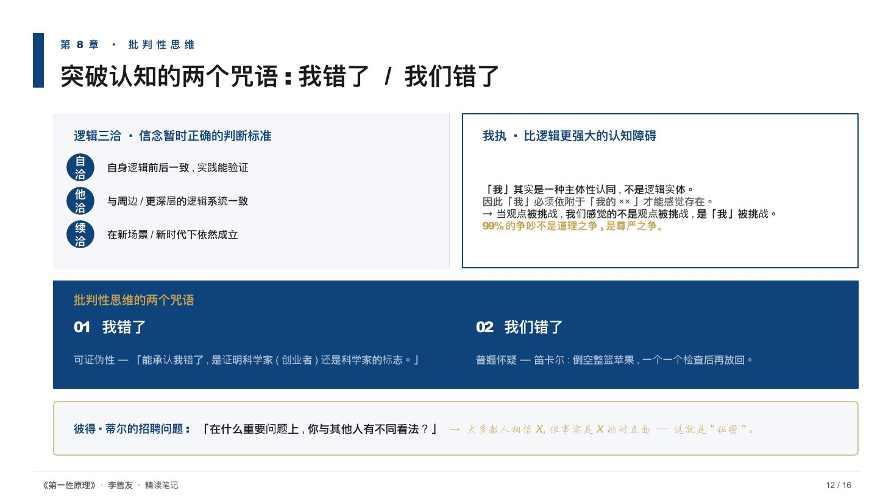<figcaption>12</figcaption></figure>
<figure><figcaption>13</figcaption></figure>
<figure>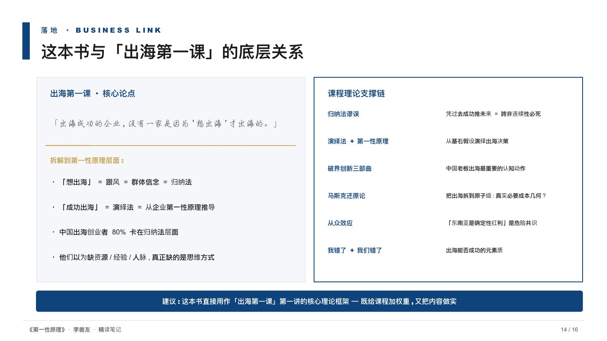<figcaption>14</figcaption></figure>
<figure>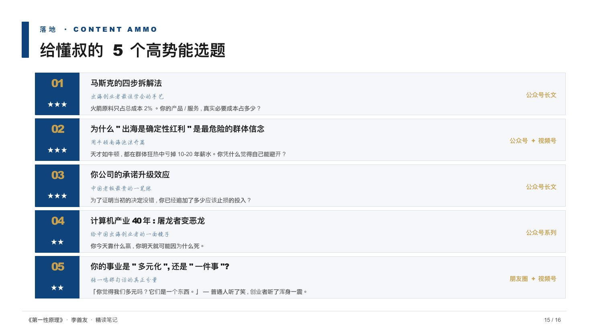<figcaption>15</figcaption></figure>
<figure><figcaption>16</figcaption></figure>

